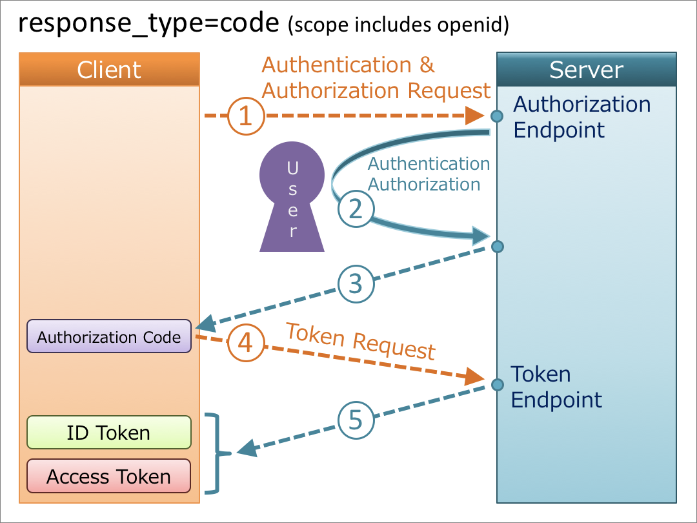
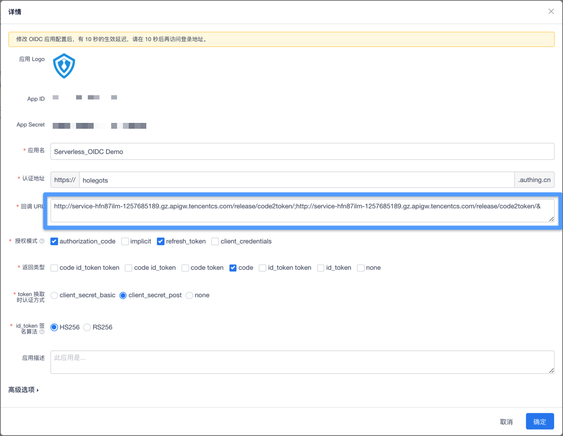
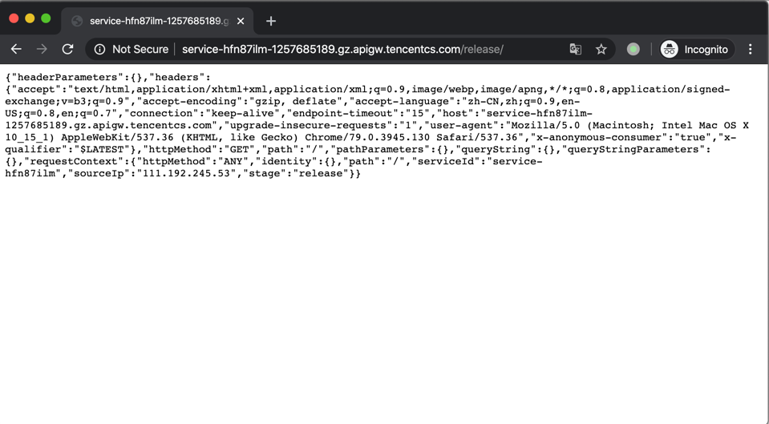
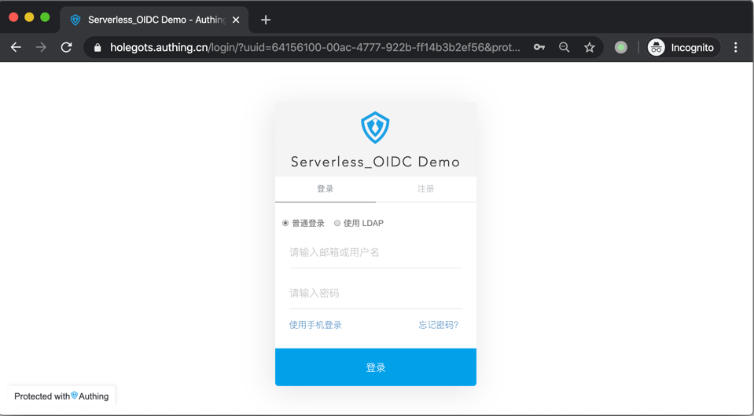
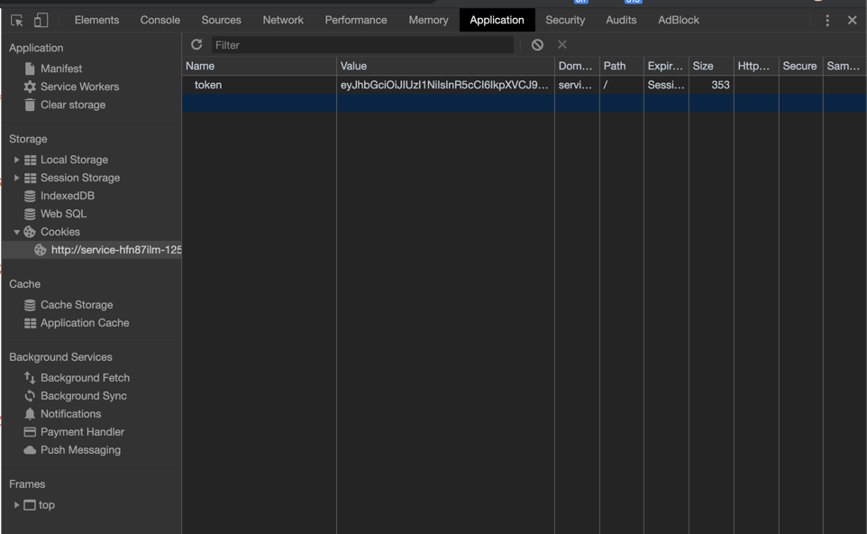

# Serverless-OIDC


Serverless Authing OIDC(OpenID Connect) Demo.

<!-- <p align="center">
  <span>简体中文</span> |
  <a href="./README_en.md">English</a>
</p> -->

## 什么是 OIDC 协议

> OpenID Connect 1.0 is a simple identity layer on top of the OAuth 2.0 protocol. It allows Clients to verify the identity of the End-User based on the authentication performed by an Authorization Server, as well as to obtain basic profile information about the End-User in an interoperable and REST-like manner.

**OpenID Connect 简称 OIDC，是 OAuth 2.0 的一个扩展，主要增加了语义化的用户信息字段。**

下图是一个以授权码为例子的 OIDC 授权流程：


更多信息可以查看 [OIDC 流程](https://docs.authing.cn/authing/advanced/oidc/understand-oidc)。

## 应用介绍 🏠

您可以通过以下几步操作快速的创建一个带有OIDC功能的Serverless应用。

## 示例链接 🔗

[Serless Oidc echo Demo](http://service-hfn87ilm-1257685189.gz.apigw.tencentcs.com/release/login/)

## 使用流程
他需要这几个路由：
|  Route  | Desc |
|  ----  | ----  |
| /login/ | 实现登录的跳转 |
| /code2token/  | 通过获取返回的 `Code`<br>来换取 `Token` 同时会<br>将 `token` 设置在`Cookie`<br>中 以及跳转到 `/` 路由 |
| /refreshtoken/  | 刷新 `Token` |
| /status/  | 返回 `OIDC` 应用正常与否|
| /checktoken/ | 返回 `Token` 是否有效 |
| /userinfo/  | 通过 `Token` 换取用户信息 |

在完成认证以后会跳转至`/`路由，在这个路由下的应用只需要对 `Cookie` 进行查看，即可获取用户登录情况 以及获取用户的 `Token` 从而来完成其他的业务流程。


## 前提条件 🧾

在使用之前，请确保具备以下条件：

1.  [Node.js](https://serverlesscloud.cn/doc/providers/tencent/cli-reference/quick-start#node) （8.x 或以上的版本）
2.  Serverless Framework CLI
3.  Authing OIDC AppID && Secret && 认证地址

### 安装 Node.js 和 NPM

- 参考 [Node.js 安装指南](https://nodejs.org/zh-cn/download/) 根据您的系统环境进行安装。
- 安装完毕后，通过 `node -v` 命令，查看安装好的 `Node.js` 版本信息：

```shell
$ node -v
vx.x.x
```

- 通过 `npm -v`命令，查看安装好的 `npm` 版本信息：

```shell
$ npm -v
x.x.x
```

### 安装 Serverless Framework CLI

- 在命令行中运行如下命令：

```shell
$ npm install -g serverless
```

- 安装完毕后，通过运行 `serverless -v` 命令，查看 `Serverless Framework CLI` 的版本信息。

```shell
$ serverless -v
x.x.x
```
### 获取 Authing 必须信息
<p>
1. 首先注册一个 <a href="https://sign.authing.cn/login" target="_blank">Authing 账号</a>。

<p>
2. 注册完成后在控制台中依次点击 <strong>第三方登录</strong> -> <strong>OIDC 应用</strong>后，可以看到OIDC 应用列表，点击应用名即可看到该应用信息。
</p>


<p>
3. 在应用信息中可以看到 <strong>AppID</strong>、<strong>Secret</strong>和<strong>认证地址</strong>。
</p>


## 创建应用 🚗

### 1. 创建需要的文件

本地创建 `serverless.yml`文件：

```shell
touch serverless.yml
```

### 2. 编辑 `serverless.yml` 文件

在 serverless.yml 中进行如下配置

```yml
# serverless.yml
firstApp:
  component: 'serverless-oidc'
  inputs:
    region: ap-shanghai
  authing:
    oidc: 
      client_id: 你的 OIDC 应用 id
      domain: 你的 OIDC 应用认证地址
      scope: openid profile
      grant_type: authorization_code
      prompt: login
      client_secret: 你的 OIDC 应用 secret
      response_type: code
```
### 3. 获取 Token
在根目录下创建`app`目录，以及入口文件`app.js`。
```sh
mkdir app&& touch app/app.js
```
这里我们以一个`echo`服务为例子
在`app.js`文件中修改
```js
exports.callback = async function echo(event, context){
    // 此函数可用来获取 oidc 签发的 token，然后可用 token 换取 userInfo
    // token 获取方式：event.xxx.token
    return { 
        headers: {"Content-Type": "application/json"}, 
        body: JSON.stringify(event), 
        statusCode: 200,
    }
}
exports.pathMap = [
    { path: "/", handlerName: "callback" },
]

```
其中 `pathMap`定义了，不同的路由对应的函数的关系。
`echo` 函数的定义是，腾讯 `云函数` 的写法。
[云函数文档](https://cloud.tencent.com/document/product/583)

## 部署 🛫️

使用 `serverless` 部署应用是十分简单的。
只需要通过`sls`命令即可完成部署，并可以添加`--debug`参数查看部署过程中的信息。
如您的账号未登录或注册腾讯云，您可以直接通过微信扫描命令行中的二维码进行授权登录和注册。

```shell
$ sls --debug

```
在执行命令以后 等待应用部署以及配置API网关即可完成部署
### 账号配置（可选）

当前默认支持 CLI 扫描二维码登录，如你希望配置持久的环境变量/秘钥信息，也可以本地创建 `.env` 文件
在 .env 文件中配置腾讯云的 SecretId 和 SecretKey 信息并保存

```
# .env
TENCENT_SECRET_ID=123
TENCENT_SECRET_KEY=123
```

## 配置回调地址

部署完成后命令行界面会返回项目的 `url` 地址。

```sh
$ sls
start uploading function echo
start uploading function getAuthorizationURL
start uploading function getTokenByCode
start uploading function refreshToken
start uploading function status
start uploading function checkToken
start uploading function getUserInfoByAccessToken

  region:              ap-guangzhou
  appName:             Authing-OIDC_wnitzx
  route: 
    - 
      path:     /
      method:   ANY
      function: 
        isIntegratedResponse: true
        functionName:         echo
    - 
      path:     /login/
      method:   ANY
      function: 
        isIntegratedResponse: true
        functionName:         getAuthorizationURL
    - 
      path:     /code2token/
      method:   ANY
      function: 
        isIntegratedResponse: true
        functionName:         getTokenByCode
    - 
      path:     /refreshtoken/
      method:   ANY
      function: 
        isIntegratedResponse: true
        functionName:         refreshToken
    - 
      path:     /status/
      method:   ANY
      function: 
        isIntegratedResponse: true
        functionName:         status
    - 
      path:     /checktoken/
      method:   ANY
      function: 
        isIntegratedResponse: true
        functionName:         checkToken
    - 
      path:     /userinfo/
      method:   ANY
      function: 
        isIntegratedResponse: true
        functionName:         getUserInfoByAccessToken
  apiGatewayServiceId: service-hfn87ilm
  url:                 http://service-hfn87ilm-1257685189.gz.apigw.tencentcs.com/release/
```
如上图数据 `url`即为 `http://service-hfn87ilm-1257685189.gz.apigw.tencentcs.com/`

由于安全性你需要在`Authing`的`OIDC`详情中配置回调 URL 来允许我们创建的 `serverless 应用`使用 `OIDC` 登录服务。  
在前面的准备阶段我们已经提过如何访问找到`OIDC`的详情页面。如果没有找到，还请返回查看。
在详情页面中 我们只需要在`回调 URL` 的部分中将我们的`app url`+'/code2token/' 填写进去即可。


如上图的刚才运行的例子 即填写
`http://service-hfn87ilm-1257685189.gz.apigw.tencentcs.com/release/code2token/`

## 测试项目
由于，我们在启动的是一个 `echo` 服务，所以他会显示访问信息并且不会自行进行跳转至登录接口。需要我们手动去访问登录的  `URL`。 

这个时候访问 `/login/` 路由即可跳到登录界面，`url`为  
`http://service-hfn87ilm-1257685189.gz.apigw.tencentcs.com/release/login/`。
我们在浏览器进行访问，即可发现已经跳转到了 `Authing` 登录页面。

在完成登录以后会自动执行 `Code` 换取 `Token` 的流程，并且会带着 `Cookie` 重新跳回到 `/` 路由,这个时候我们可以看到，返回的信息中多了 `Token` 而且在 `Cookie` 项中我们也可以看到，已经有了 `Token` 的值.

## Todo List
由于时间不足 项目存在很多不足 尚需要完善
这是计划做的列表：
- [ ] 完善文档说明&增加英文文档
- [ ] 增加更加直观的 Demo
- [ ] 改变 `SCF` 上传流程 通过复用压缩包加快函数上传速度
- [ ] 增加接口的测试用例
- [ ] 增加 `Cookie` 字符串的生成选项
- [ ] 增加 Authing 的其他登录方式